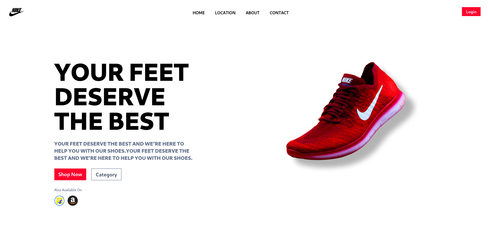

# Nike Shoes Website Landing Page
> This website is just a single page site, built with React + TailwindCSS.




## To Install
To download just this folder, you can use `git sparse-checkout`.

STEP 1:

```shell
mkdir <repo_name>
cd <repo_name>
git init
git remote add -f origin <repo_url>
```

STEP 2:
```shell
git sparse-checkout init

# set the folder name you want git to download
git sparse-checkout set "Nike-Landing-Page"

# pull it from remote
git pull origin master
```

STEP 3:

```shell
cd Nike-Landing-Page

npm install

npm run dev
```